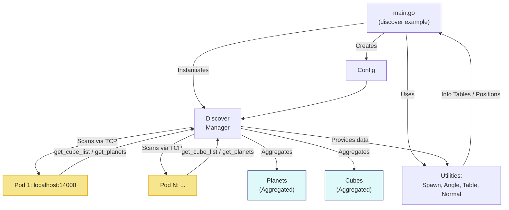

# Discover

Discover is a Go package designed for scanning and gathering information from multiple networked pods. It enables the discovery of cubes and planets within these pods and provides utility functions to manipulate and analyze the discovered data. This package is ideal for applications that need to explore and interact with distributed simulation or game server environments.

## Mermaid source code



## Installation

To install the Discover package, run the following command:

```bash
go get github.com/OpenFluke/discover
```

## Usage

The following example demonstrates how to use the Discover package to scan pods, retrieve data, and leverage utility functions. You can find this example in the repository at [examples/helloworld](https://github.com/OpenFluke/discover/tree/main/examples/helloworld).

```go
package main

import (
	"discover"
	"fmt"
)

func main() {
	cfg := discover.Config{
		Hosts:      []string{"localhost"},
		StartPort:  14000,
		PortStep:   3,
		NumPods:    1,
		AuthPass:   "my_secure_password",
		Delimiter:  "<???DONE???---",
		TimeoutSec: 10,
	}

	disco := discover.NewDiscover(cfg)
	disco.ScanAll()
	disco.PrintSummary()

	fmt.Println("\n-- Discovered Planets --")
	for name, p := range disco.Planets {
		fmt.Printf("%s at %v (host: %s)\n", name, p.Coordinates, p.Host)
	}

	fmt.Println("\n-- Discovered Cubes --")
	for cube, host := range disco.Cubes {
		fmt.Printf("%s at %s\n", cube, host)
	}

	// --- Use the new extras.go features ---
	fmt.Println("\n== Planet Info Table ==")
	table := disco.GetPlanetInfoTable()
	for _, row := range table {
		fmt.Println(row)
	}

	// Pick the first planet as an example
	var firstPlanetName string
	for name := range disco.Planets {
		firstPlanetName = name
		break
	}
	if firstPlanetName == "" {
		fmt.Println("No planets found.")
		return
	}
	planet := disco.Planets[firstPlanetName]
	center := planet.Coordinates[:] // Copy to slice

	// Generate 5 spawn positions at radius 120 around the first planet
	fmt.Printf("\n== Spawning 5 units around %s ==\n", firstPlanetName)
	spawnPositions, _ := disco.GenerateSpawnPositions(firstPlanetName, 5, 120.0)
	for i, pos := range spawnPositions {
		angle := discover.CalculateRotationOutward(center, pos)
		normal := discover.OutwardNormal(center, pos)
		free := disco.IsSpawnPointFree(pos, 50.0)
		fmt.Printf("Spawn %d: pos %v | Face angle: %.2f | Normal: %v | Free? %v\n", i+1, pos, angle, normal, free)
	}

	// Example: Find closest planet to a random point
	testPoint := []float64{500, 1000, 0}
	closest, dist := disco.FindClosestPlanet(testPoint)
	fmt.Printf("\nClosest planet to %v is %s (distance %.2f)\n", testPoint, closest, dist)
}
```

### Configuration

The `Config` struct defines the scanning parameters:

- `Hosts`: List of hostnames or IP addresses to scan (e.g., `[]string{"localhost"}`).
- `StartPort`: Initial port number for scanning (e.g., `14000`).
- `PortStep`: Port increment for each subsequent pod (e.g., `3`).
- `NumPods`: Number of pods to scan per host (e.g., `1`).
- `AuthPass`: Authentication password for pod access (e.g., `"my_secure_password"`).
- `Delimiter`: Message delimiter for communication (e.g., `"<???DONE???---"`).
- `TimeoutSec`: Network operation timeout in seconds (e.g., `10`).

### Scanning and Summary

- `NewDiscover(cfg)`: Initializes a new Discover instance with the specified configuration.
- `ScanAll()`: Scans all configured pods concurrently and stores the results.
- `PrintSummary()`: Outputs a summary of the scan, including successful pods, total cubes, total planets, and unique planets.

### Discovered Data

- **Planets**: Accessible via `disco.Planets`, a map with planet names as keys and `PlanetRecord` structs as values (containing name, coordinates, host, and port).
- **Cubes**: Accessible via `disco.Cubes`, a map with cube names as keys and their associated hosts as values.

### Utility Functions

The `extras.go` file provides additional functionality:

- `GetPlanetInfoTable()`: Returns a table of planet data as a slice of string slices.
- `GenerateSpawnPositions(planetName string, n int, radius float64)`: Generates `n` evenly spaced spawn points around a planet using the Fibonacci sphere algorithm.
- `CalculateRotationOutward(center, position []float64)`: Computes the outward-facing angle (in degrees) from a planet’s center to a position.
- `OutwardNormal(center, point []float64)`: Returns the normalized outward vector from a planet’s center to a point.
- `IsSpawnPointFree(point []float64, minDist float64)`: Checks if a spawn point is at least `minDist` away from all planets.
- `FindClosestPlanet(point []float64)`: Identifies the nearest planet to a given point, returning its name and distance.

### Example Output

Running the example code produces output like this:

```
=== D.I.S.C.O.V.E.R.™ SUMMARY ===
[localhost:14000] ✅ Cubes=0 Planets=27

Successful pods: 1 / 1
Total Cubes: 0
Total Planets: 27
Unique Planets: 27

-- Discovered Planets --
(1, 1, 0) at [800 800 0] (host: localhost)
(0, 1, 0) at [0 800 0] (host: localhost)
(1, 2, 1) at [800 1600 800] (host: localhost)
[... additional planets ...]

-- Discovered Cubes --

== Planet Info Table ==
[Name X Y Z Host Port]
[(0, 0, 0) 0.000 0.000 0.000 localhost 14000]
[(0, 0, 1) 0.000 0.000 800.000 localhost 14000]
[(0, 0, 2) 0.000 0.000 1600.000 localhost 14000]
[... additional rows ...]

== Spawning 5 units around (1, 1, 0) ==
Spawn 1: pos [800 920 0] | Face angle: 0.00 | Normal: [0 1 0] | Free? true
Spawn 2: pos [723.3703783548974 860 70.19901058083664] | Face angle: 137.51 | Normal: [-0.6385801803758552 0.5000000000000002 0.5849917548403055] | Free? true
[... additional spawn points ...]

Closest planet to [500 1000 0] is (1, 1, 0) (distance 360.56)
```

## Package Structure

- **discover.go**: Defines the `Discover` struct and core methods (`ScanAll`, `PrintSummary`) for scanning multiple pods.
- **extras.go**: Contains utility functions for working with planets and spawn positions.
- **pod.go**: Implements pod communication logic, including authentication and data retrieval.

## Requirements

- Go 1.16 or later
- No external dependencies beyond the Go standard library
